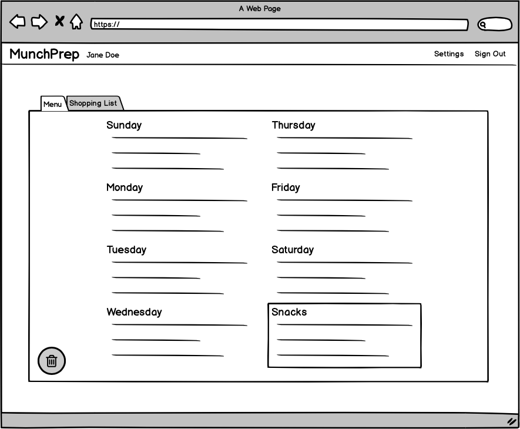
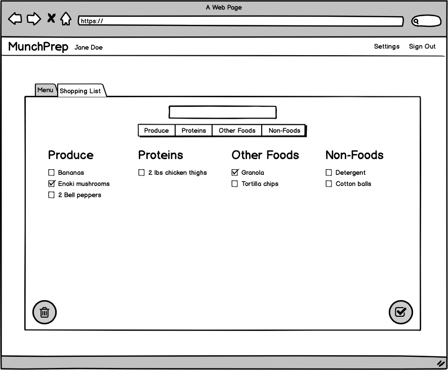
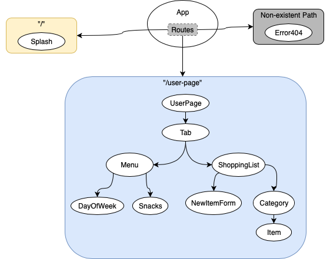

# Project Proposal - MunchPrep

### Project’s Purpose or Goal
* MVP: Allow user to make a grocery list, categorized by store section, and allow user to create a meal plan for the week (Web app)
* Beyond MVP: Create a React Native version of the app; allow user to customize settings

### MVP Features
* CRUD functionality for meal plan and shopping list
* Deployed relational database and user authentication via Firebase
* Mobile-friendly UI

### Technologies Used for MVP
* Firebase
* React
* Redux

### Extra Features (Beyond MVP)
* Native mobile app
* Custom categories
* Custom starting day of week for meal plan

### Technologies Used for Extra Feaures
* React Native

# Web App Mock-Ups




# React Component and Route Structure


# React States
`Menu` component will hold the `menusByDay` and `snacks` state slices.
```
{
  menusByDay: {
    1: {
      name: "Sunday",
      meals: {
        "breakfast": {
          name: "Scrambled eggs"
        },
        "lunch": {
          name: "Cobb salad"
        },
        "dinner": {
          name: "Grilled salmon"
        }
      }
    },
    2: { ... }
    ...
  },
  snacks: "carrots, cherries",

}
```

`ShoppingList` component will hold the `itemsByCategory` state.
```
{
  itemsByCategory: {
    1: {
      name: "Produce",
      items: {
        1: {
          name: "broccoli",
          checked: false
        },
        2: {
          name: "strawberries",
          checked: true
        }
      }
    },
    ...
  }
}
```